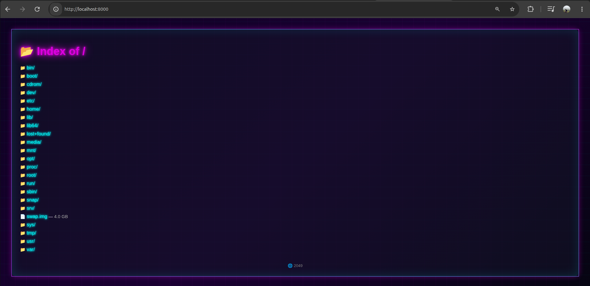

# Localserver

A simple python HTTP local file server, inspired from Blade Runner 2049 aesthetics.

---

# Why?
``` python -m http.server ``` didn't have RGB :)

## Installation

Available on **TestPyPI** for now:

```bash
pip install -i https://test.pypi.org/simple/ localserver
```

## Usage
Run the server:
```bash
localserver
```
by default, it will listen on 0.0.0.0:8000

You can also specify host and port:
```bash
localserver -b <host> -p <port>
```

# Known Issues
- File responses can sometimes be slow.
- keep-alive connections.